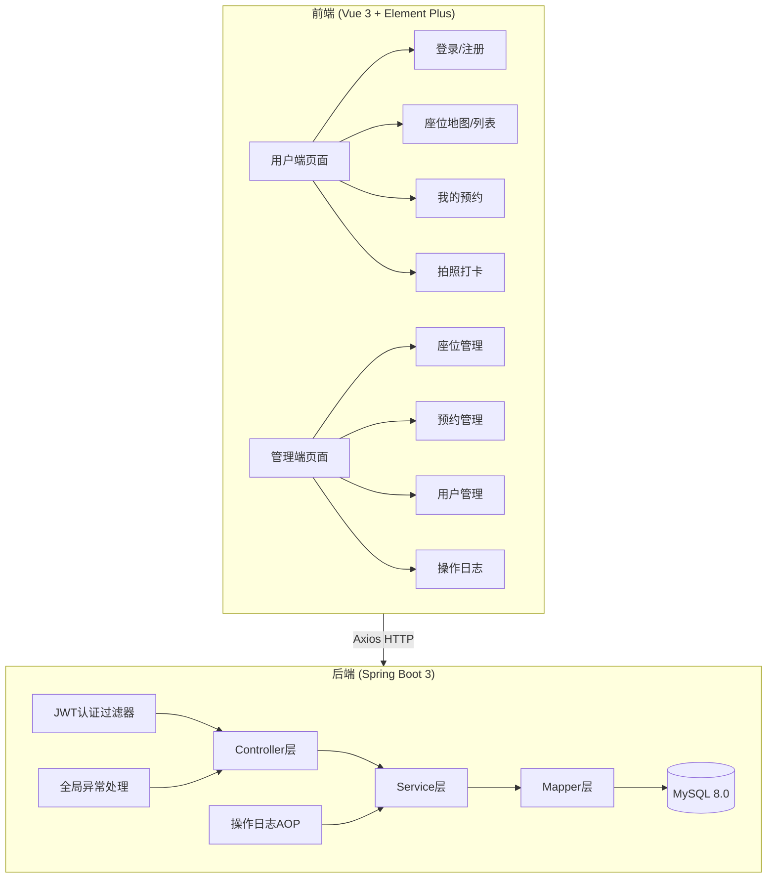
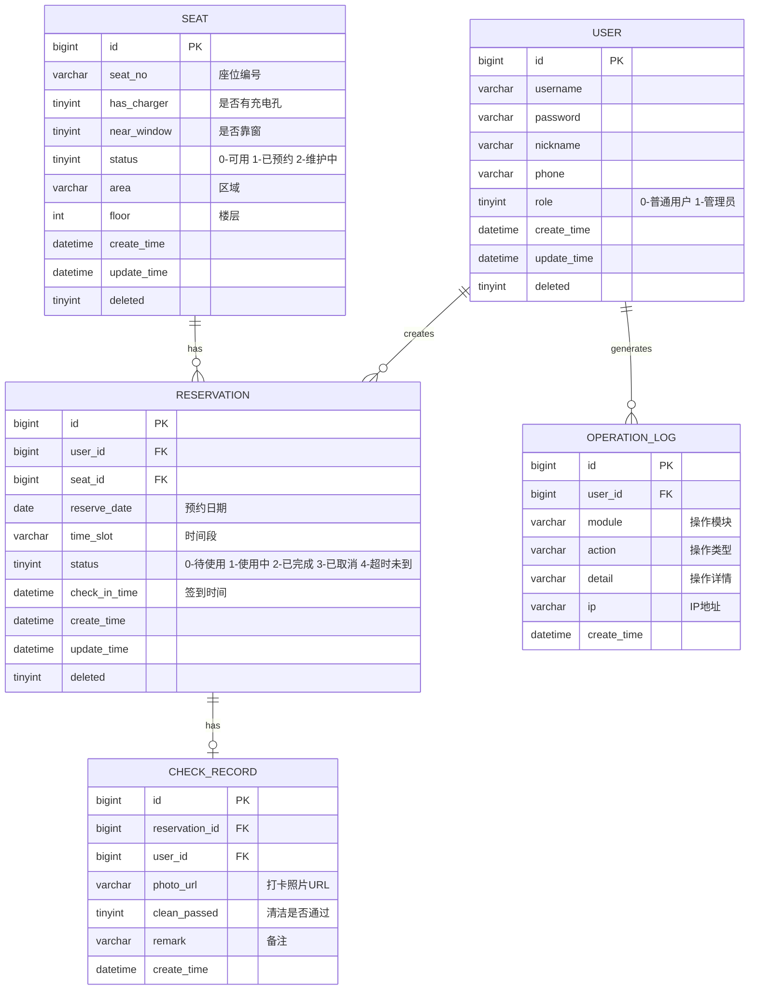

# 图书馆自习座位预约系统 - 项目设计文档

## 1. 系统架构

## 2. ER 图

## 3. 接口清单

### AuthController - 认证模块
| Method | Path | Description |
|--------|------|-------------|
| POST | /api/auth/login | 用户登录 |
| POST | /api/auth/register | 用户注册 |
| GET | /api/auth/info | 获取当前用户信息 |

### SeatController - 座位模块
| Method | Path | Description |
|--------|------|-------------|
| GET | /api/seat/list | 座位列表(支持筛选) |
| POST | /api/seat | 新增座位(管理员) |
| PUT | /api/seat | 修改座位(管理员) |
| DELETE | /api/seat/{id} | 删除座位(管理员) |

### ReservationController - 预约模块
| Method | Path | Description |
|--------|------|-------------|
| POST | /api/reservation | 创建预约 |
| GET | /api/reservation/my | 我的预约列表 |
| PUT | /api/reservation/cancel/{id} | 取消预约 |
| PUT | /api/reservation/checkin/{id} | 签到 |
| GET | /api/reservation/list | 所有预约(管理员) |

### CheckRecordController - 打卡模块
| Method | Path | Description |
|--------|------|-------------|
| POST | /api/check/upload | 上传清洁打卡照片 |
| GET | /api/check/{reservationId} | 查看打卡记录 |
| GET | /api/check/list | 打卡记录列表(管理员) |

### UserController - 用户管理模块
| Method | Path | Description |
|--------|------|-------------|
| GET | /api/user/list | 用户列表(管理员) |
| PUT | /api/user/status/{id} | 启用/禁用用户(管理员) |

### OperationLogController - 日志模块
| Method | Path | Description |
|--------|------|-------------|
| GET | /api/log/list | 操作日志列表(管理员) |

## 4. UI/UX 规范

- **主色调**: `#409EFF` (Element Plus 蓝)
- **辅助色**: `#67C23A` (成功绿), `#E6A23C` (警告橙), `#F56C6C` (危险红)
- **背景色**: `#F5F7FA` (页面背景), `#FFFFFF` (卡片背景)
- **字体**: `"Helvetica Neue", Helvetica, "PingFang SC", "Microsoft YaHei", sans-serif`
- **字号**: 标题 `20px`, 正文 `14px`, 辅助文字 `12px`
- **卡片圆角**: `8px`
- **卡片阴影**: `0 2px 12px rgba(0, 0, 0, 0.08)`
- **间距体系**: `8px / 16px / 24px / 32px`
- **按钮圆角**: `4px`
